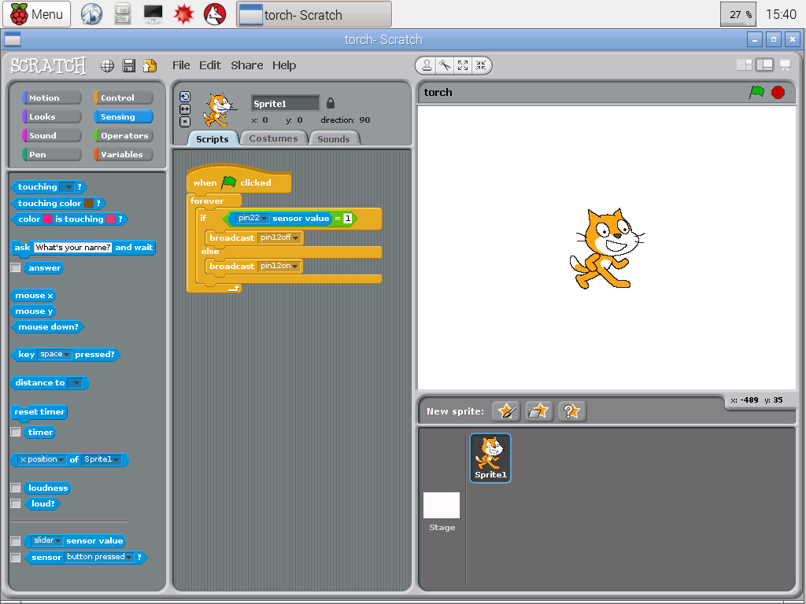
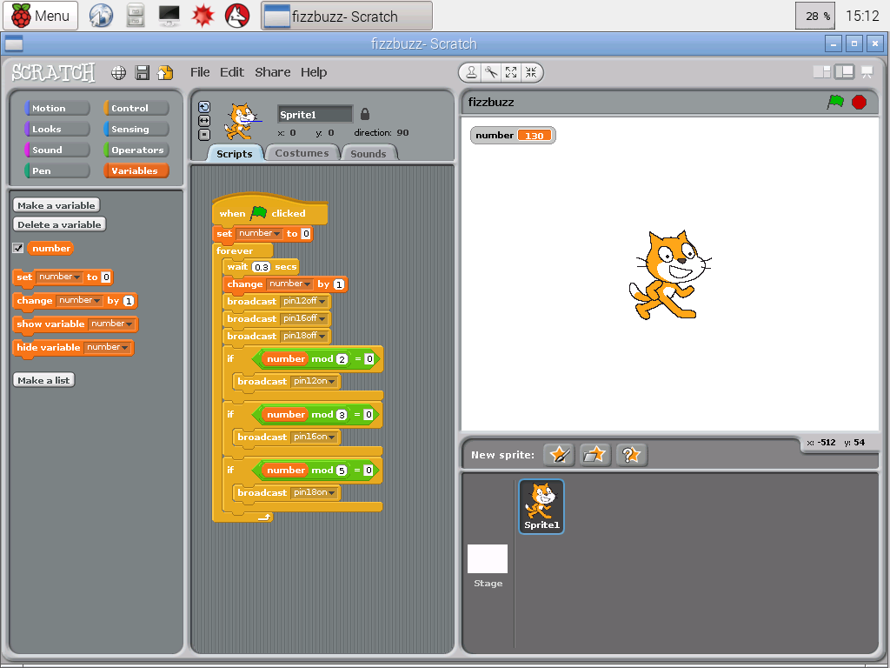
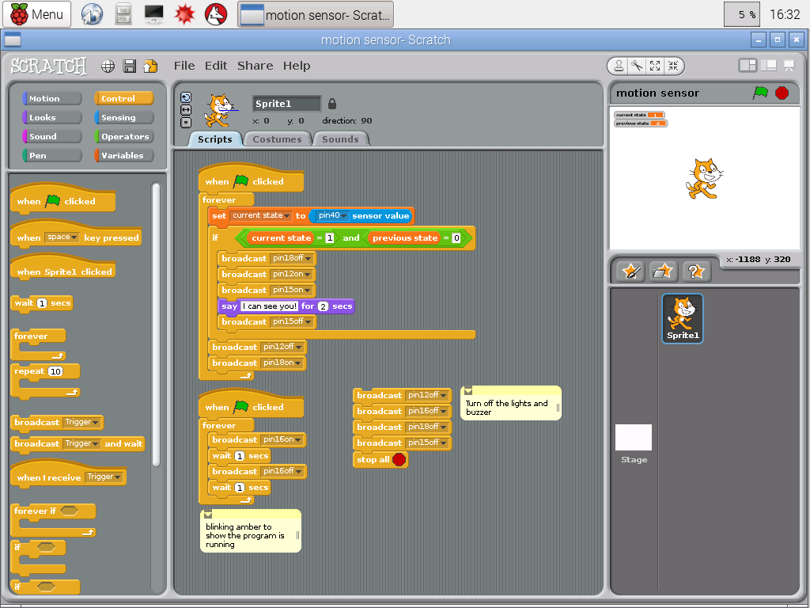

# scratch-gpio-hackathon
## Example Code
The following Scratch programs were created by [Sean McManus](https://twitter.com/musicandwords).  (c) Sean McManus.

- [Torch](torch.sb)
   
- [Fizzbuzz](fizzbuzz.sb)
   
- [Motion Sensor](motion-sensor.sb) (requires [CamJam EduKit 2 - sensors](http://camjam.me/?page_id=623))
    

The following example projects were created by the [Raspberry Pi Foundation](http://www.raspberrypi.org/) and released under a [Creative Commons](http://www.raspberrypi.org/creative-commons/) Licence:

- [Robot Antenna](Worksheet-Sweet-Shop-Reaction-Game-Raspberry-Pi-Learning-Resources.pdf)
- [Sweet Shop Reaction Game](Worksheet-Robot-Antenna-Raspberry-Pi-Learning-Resources.pdf)

