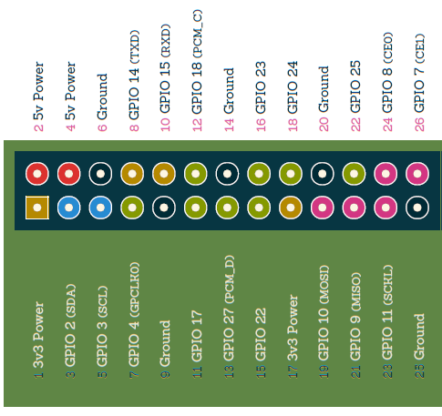
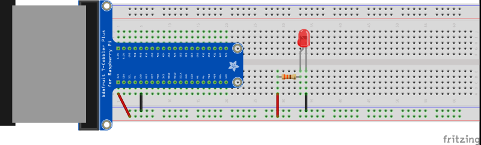
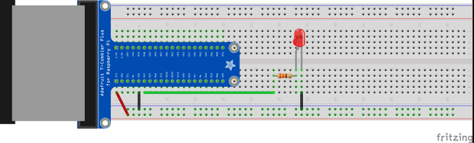
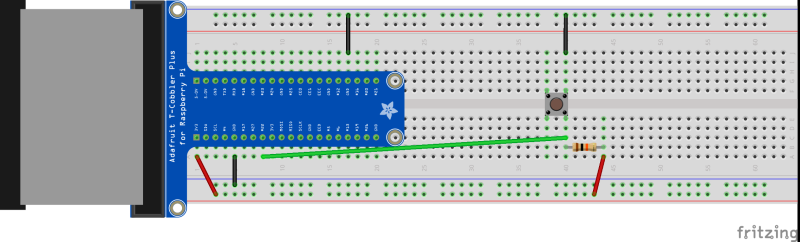

## scratch-gpio-hackathon

#GPIO Hackathon!

----------

Resources for [Raspberry Pi](http://www.raspberrypi.org/) [Scratch](http://scratch.mit.edu/) GPIO Hackathon using basic electronics (à la [CamJam](http://camjam.me/)'s [EduKit](http://camjam.me/edukit) or [ExploreSTEM](http://www.explorestem.co.uk/)'s [IET](http://www.theiet.org/) Raspberry Pi kits)

Session leader:

- David Bower [@rddave](https://twitter.com/rddave)

----------

In this **Scratch GPIO Hackathon**, teams of 2 or 3 young programmers will work together to make a Scratch project which interfaces with basic electronic inputs and outputs (similar to those found in [CamJam](http://camjam.me/)'s [EduKit 1](http://camjam.me/edukit)).

The electronic components available are:

- a red, green and yellow LED
- a push button(s)
- a buzzer (or a speaker could be used)
- resistors

## GPIO Pins

Each GPIO pin has a different function.  There are:

- power pins (of two different voltages)
- ground pins (or negative pins)
- various other *general purpose input/output* pins (GPIO)

**Only use the 3.3V positive pins for these circuits.**

GPIO Pinout image taken from [Phil Howard](https://twitter.com/gadgetoid)'s [GPIO Pinout](http://pi.gadgetoid.com/pinout). 

## Starters For Ten!

To give our young programmers a starting point, here are *Hello World* electronics examples.  Use these as a starting point to get to grips with how to use basic electronics with a breadboard.

Once you've got the hang of these examples, modify and combine the circuits to interact with your own fantastic Scratch project.

The [Adafruit](https://www.adafruit.com/) [Pi T-Cobbler](https://www.adafruit.com/products/1754) used may be smaller than that shown in these example layouts - just make sure the same pins are used!  The Cobbler is a handy way of extending Raspberry Pi's GPIO pins to the breadboard, but jumper wires straight from the GPIO pins can be used without a Cobbler.

### Always-on LED

The resistor is 330 Ohm with colour bands orange-orange-red.

This circuit demonstrates the following:

- a circuit has to be complete, connecting negative through to positive - **trace with your finger the complete circuit, what components does it go through?**
- the LED has different *legs*, one positive, one negative - **which are which?  There are three ways to tell!**
- LEDs require a *current limiting* resistor - this protects the LED

#### Questions on this circuit

1. which pins are connected to each other when the breadboard is empty?
2. does it matter where, exactly, the LED circuit is located?  Will it still work if it's move left or right along the bread board?
3. is this circuit controllable from Scratch?

### Scratch-Controllable LED

Alter the circuit from above to make a Scratch-controllable LED.  Only *two* modifications are required!

In order to control this circuit in ScratchGPIO you will need to make use of the following Scratch blocks, **one at a time, not together!**:

#### Questions on this circuit

1. Which GPIO pin number is used to turn on/off the LED?
2. Can any other GPIO pins be used to control the LED?  (tip, it's not all of them!)

### Push Button

The resistor is 10K Ohm with colour bands brown-black-black-red.

In order to respond to button pushes in ScratchGPIO you will need to make use of the following Scratch block:

The important part is the *pin22 sesor value* part.  This part can be used within other Scratch blocks, for example *If*.  **Note**, the example layout above does *not* use pin 22!

#### Questions on this circuit

1. How else can *sensor value* be used in Scratch to control a Scratch programme?
2. Can any other GPIO pins be used to read the push button state (pressed or un-pressed)?  (tip, as before, it's not all of them!)
3. Why is the resistor required?  How does your Scratch programme change if you don't have the resistor?

## Additional Resources That Are Available

- [Introduction to the GPIO header](http://www.raspberrypi.org/documentation/usage/gpio/) from the [Raspberry Pi Foundation](https://twitter.com/raspberry_pi)

- [Sean McManus](https://twitter.com/musicandwords) has created three starter example projects, Torch, FizzBuzz and Burglar Alarm (the last of these requires CamJam EduKit 2) here [www.sean.co.uk/books/raspberry-pi-for-dummies/scratch-gpio.shtm](http://www.sean.co.uk/books/raspberry-pi-for-dummies/scratch-gpio.shtm)  Code for these projects is available.

- [Scratch Cards](Scratch-1.4/ScratchCardsAll-v1.4-PDF) for any members of the group who are unfamilar with Scratch and who need a basic introduction.

- Example Scratch GPIO projects from the [Raspberry Pi Foundation](http://www.raspberrypi.org/):

  - [Robot Antenna](http://www.raspberrypi.org/learning/robot-antenna/worksheet/)
  - [Sweet Shop Reaction Game](http://www.raspberrypi.org/learning/reaction-game/)

- [CamJam](http://camjam.me/) [EduKit 1](http://camjam.me/?page_id=236#download) Python worksheets.  These could be used be very able members of the group directly in Python, or as a challenge to convert to Scratch.

## WARNING!  GPIO Safety

It is **very important** that GPIO safety information is reviewed in the Introduction to the GPIO Header document - close attention must be paid to the correct connection of GPIO pins.  Permanent damage can be caused to the Raspberry Pi due to mis-connection of GPIO header pins.

For example, the power and ground pins should not be directly connected.  The different current value power pins should not be directly connected.  Current limiting resistors should be used in order to ensure LEDs are not damaged.  Etc.

## Saving

Remember to save your work, **frequently**!  Also remember to shut down the Raspberry Pi properly at the end of the session otherwise the SD card can become damaged!

## (Loose!) Session Plan

Item | Time | Task
--- | --- | ---
1 | 5 mins | Introduction and outline of the Scratch GPIO Hackathon - create something **amazing** out of Scratch, GPIO and a few basic electronic components!  **Hightlight important safety aspect of correctly connecting GPIO pins**
2 | 5 mins | Make some teams!  Self organised teams / different skills / different abilities.  Encourage teams to brainstorm ideas of what sort of **amazing** Scratch GPIO projects could be created!
3 | 10 mins | Basics of the electronic components.  Breadboard with no bread?  Which breadboard strips are connected?  Using the Adafruit T-Cobbler and jump out to another area of the breadboard.  Resistor and LED goes in pairs.  Are both sides of an LED equal?
4 | 1 hr 30 mins | **Hackathon!** 
4 | 30 mins | Show & tell.  What did you create?  What did you learn?  What would you do next to further extend the project? 
5 | 10 mins | Final save, proper shutdown of Pis!  

## Show & Tell

The workshop will finish with a **show & tell**!  Those teams that want (time permitting!) will be asked to give a brief summary of what they learnt and created!!

(Facilitator note:
If required, some sort of random selection of teams to present may be required, for example [www.classtools.net/random-name-picker](http://www.classtools.net/random-name-picker/) )

## Further Information / After the Event

Gordon Henderson has a basic GPIO example with a single LED where he details why a resistor is also needed, see [projects.drogon.net/raspberry-pi/gpio-examples/tux-crossing/gpio-examples-1-a-single-led](https://projects.drogon.net/raspberry-pi/gpio-examples/tux-crossing/gpio-examples-1-a-single-led)

If you want to document your Scratch GPIO creations, you could use [Fritzing](http://fritzing.org/home/) to draw out your circuits.

## Keep Us Updated!

Please do tell us what you have gone on to create in Scratch on your PC/Mac or Raspberry Pi, and with basic electronics using Scratch GPIO on the Raspberry Pi.

Our Twitter details for parents/carers to get in touch are shown at the top of this document.

----------

These resources can be found at [https://github.com/reddog/scratch-gpio-hackathon](https://github.com/reddog/scratch-gpio-hackathon)  Download, use, modify, improve and submit a pull request for the benefit of others!

Where possible, this work is licensed under a [Creative Commons Attribution-ShareAlike 4.0 International License](http://creativecommons.org/licenses/by-sa/4.0/).  See individual files for others licence information.
