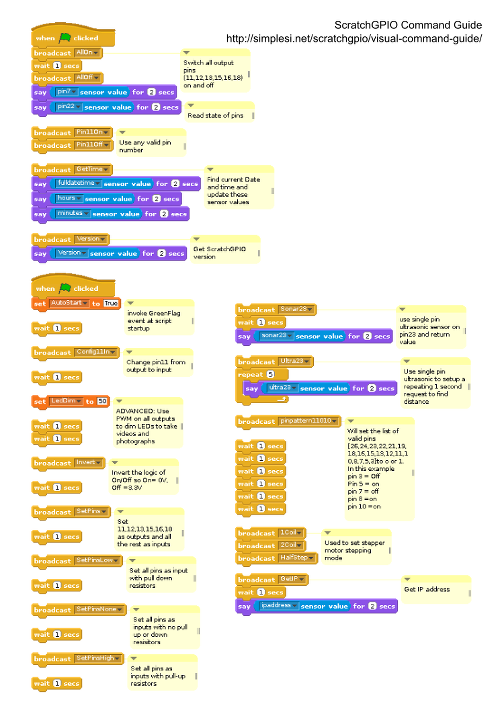

# scratch-gpio-hackathon/ScratchGPIO
## [ScratchGPIO](http://simplesi.net/scratchgpio/)

- [ScratchGPIO](http://simplesi.net/scratchgpio/) Command Guide:  [simplesi.net/scratchgpio/visual-command-guide](http://simplesi.net/scratchgpio/visual-command-guide)

[ScratchGPIO](http://simplesi.net/scratchgpio/) does not come installed as standard on [Raspbian](https://www.raspbian.org/).  Installation instructions are here [simplesi.net/scratchgpio/scratch-raspberrypi-gpio](http://simplesi.net/scratchgpio/scratch-raspberrypi-gpio).  A local copy of ScratchGPIO7 is here [install_scratchgpio7.sh](install_scratchgpio7.sh)

The ScratchGPIO Command Guide has also been chopped in half to enable better print quality on a single side of A4, see [ScratchGPIO-Command-Guide.svg](ScratchGPIO-Command-Guide.svg) and [ScratchGPIO-Command-Guide.png](ScratchGPIO-Command-Guide.png)
